# electron-boilerplate-pure

一个基于 Electron + Vue 3 的桌面应用程序框架模板（纯净版）。

## 项目概述

### 技术栈

- **前端框架**: `Vue 3`
- **桌面框架**: `Electron`
- **构建工具**: `electron-vite`
- **UI 组件库**: `Element Plus`
- **状态管理**: `Pinia` + `Electron Store`（持久化）
- **HTTP 请求**: `Electron net` 模块

### 内置功能

- **文件搜索**: 内置文件搜索功能，支持递归搜索指定目录下的所有文件。
- **文件操作**: 支持文件的读取、删除、分片等。
- **文件上传**: 内置自定义文件上传组件，支持拖拽上传。
- **接口请求**: 支持通过 `Electron` 的 `net` 模块发送 HTTP 请求。
- **主题设置**: 可以在应用中切换主题（亮色/系统/暗黑）。
- **更新管理**: 支持自动检查并下载最新版本的应用程序。
- **数据持久化**: 采用 `Electron Store` 持久化应用状态，包括用户信息、主题设置等。

### 项目结构

```plaintext
electron-app/
├── build/                 # 构建资源
├── dist/                  # 构建输出
├── src/
│   ├── main/              # Electron 主进程
│   │   ├── ipc/           # IPC 处理器
│   │   │   ├── fileHandlers.js          # 文件处理
│   │   │   ├── netRequestHandlers.js    # 网络请求
│   │   │   ├── settingHandlers.js       # 主题设置
│   │   │   └── uploadHandlers.js        # 文件上传
│   │   ├── utils/            # 工具函数
│   │   │   ├── fileType.js   # 文件类型相关
│   │   └── index.js          # 主进程入口
│   │   └── updateManager.js  # 更新管理器
│   ├── preload/           # 预加载脚本
│   │   └── index.js       # 暴露 API 到渲染进程
│   └── renderer/          # 渲染进程 (Vue 应用)
│       ├── src/
│       │   ├── api/          # API 接口定义
│       │   ├── assets/       # 资源文件
│       │   ├── components/   # 组件
│       │   ├── composables/  # 组合式函数
│       │   ├── layout/       # 布局组件
│       │   ├── router/       # 路由
│       │   ├── store/        # Pinia 状态管理
│       │   ├── utils/        # 工具函数
│       │   │   └── request/
│       │   │       ├── index.js        # 请求入口
│       │   │       └── netRequest.js   # net 模块请求
│       │   └── views/        # 页面视图
│       └── index.html
├── .env.development          # 开发环境变量
└── .env.production           # 生产环境变量
├── dev-app-update.yml        # 开发环境更新配置
├── electron-builder.yml      # 打包配置
├── electron.vite.config.mjs  # Vite 配置
└── package.json
```

## 开发

### 运行

```bash
# 安装依赖
$ yarn

# 运行项目
$ yarn dev

# 测试账号
# admin / lumos123
# lucifer / 123456
```

### 调试

- **F12**: 打开/关闭 DevTools
- **Ctrl+Shift+I**: 打开 DevTools
- 注意：`Electron` 的 `net` 请求无法在 DevTools Network 面板查看请求，可在控制台中查看日志

### 打包

```bash
# For windows
$ yarn build:win

# For macOS
$ yarn build:mac

# For Linux
$ yarn build:linux
```

### 发布流程

```bash
# 配置文件
# 开发环境 dev-app-update.yml
# 生产环境 electron-builder.yml

# 更新服务器：http://129.204.62.166:10002/pure-updates
  # 注意：请将服务器地址替换为自己的服务器地址
  # nginx配置示例：
    # location ^~/pure-updates/ {
    #   alias /path/to/electron-boilerplate-pure/;
    # }
  # `/path/to/electron-boilerplate-pure/`目录下需包含setup.exe和latest.yml文件

# ========== 第1次发布（v1.0.0）==========

# 1. 设置版本
npm version 1.0.0

# 2. 打包
yarn build:win

# 3. 上传安装包（dist/electron-boilerplate-pure-1.0.0-setup.exe）到更新服务器

# ========== 第2次发布（v1.0.1）==========

# 1. 升级版本
npm version 1.0.1

# 2. 打包
yarn build:win

# 3. 填写更新日志
# latest.yml 中的 releaseNotes 字段填写更新日志
# 格式：
releaseNotes: |
  修复了一些已知问题
  优化了应用性能
  提升了用户体验

# 强制更新标记（可选，默认 false）
forceUpdate: true
# 最低支持版本（可选，一般为最近的强制更新版本，低于此版本时也会强制更新）
minSupportVersion: 1.0.1

# 4. 上传安装包（dist/electron-boilerplate-pure-1.0.1-setup.exe）和日志文件（dist/latest.yml）到更新服务器

# 5. 已安装 v1.0.0 的用户下次启动时会自动检测到更新
```

### mock-api 服务仓库地址

[ebp-json-server](https://github.com/luciferoho/ebp-json-server)

## 项目截图

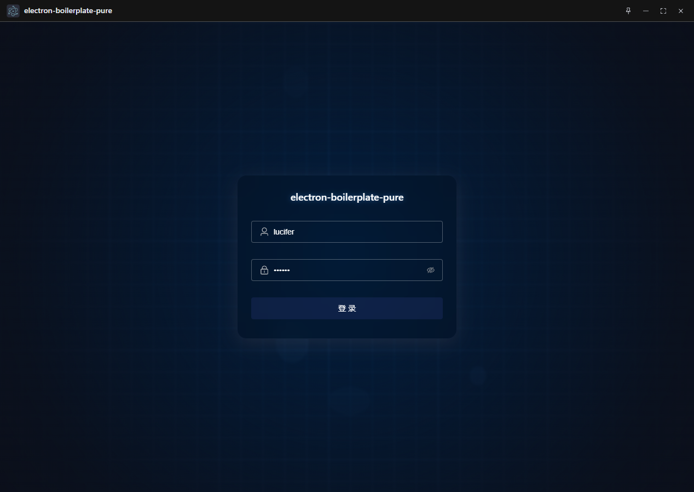

### 亮色主题

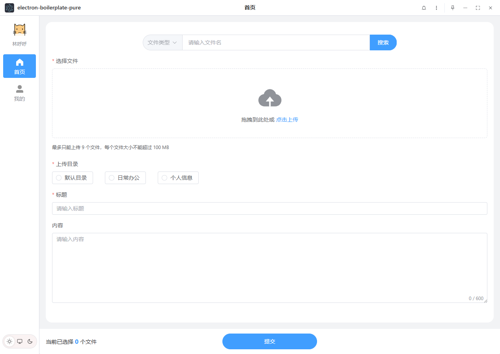
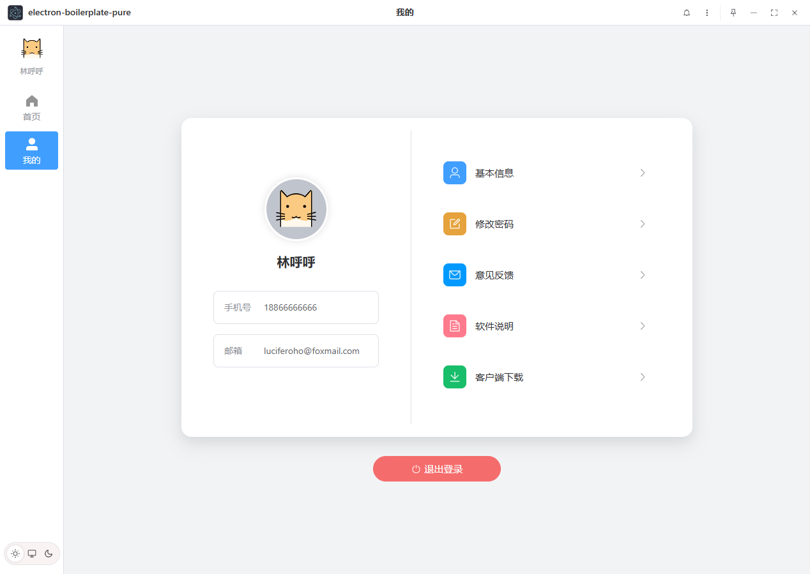
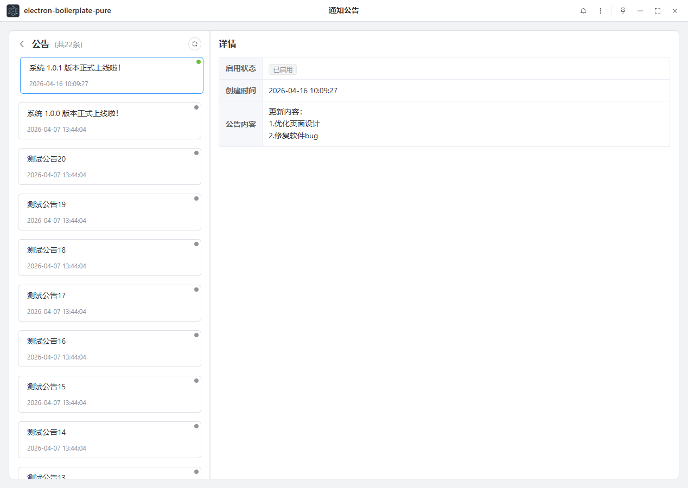
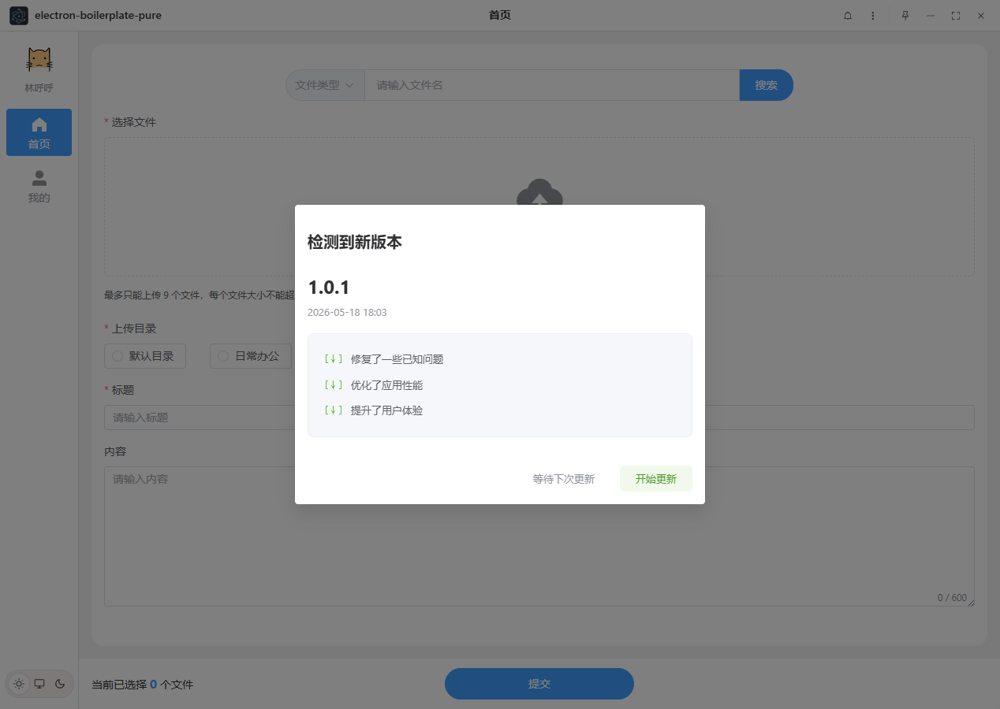
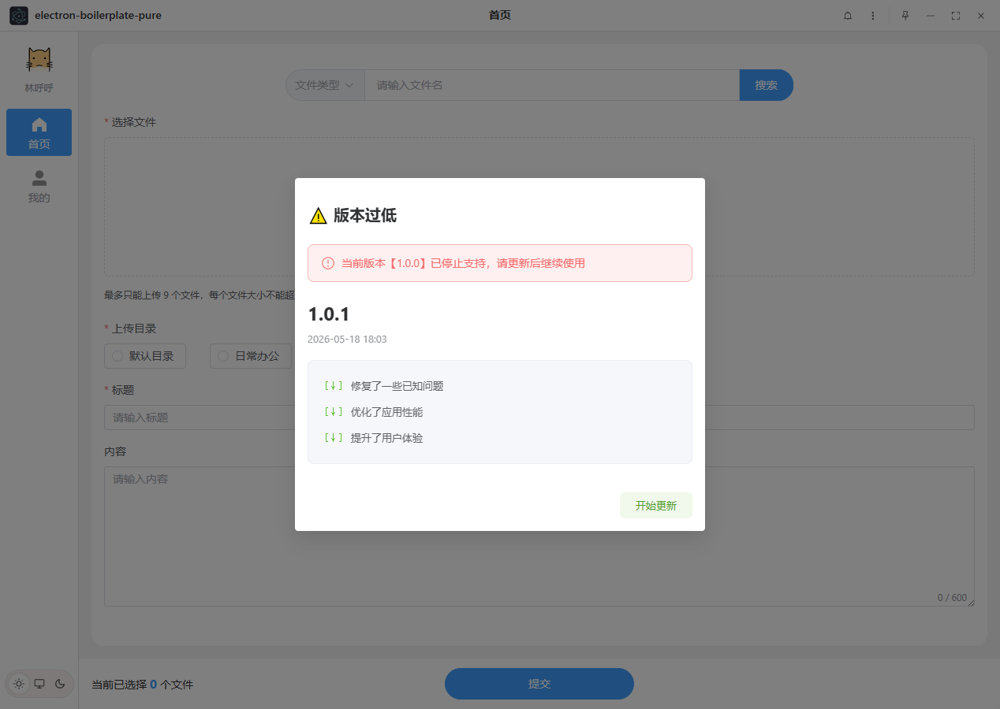

### 暗黑主题

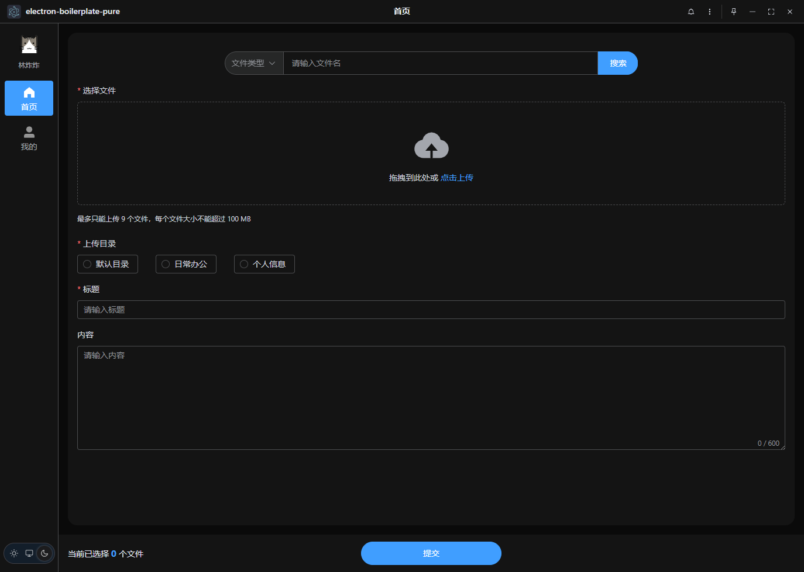
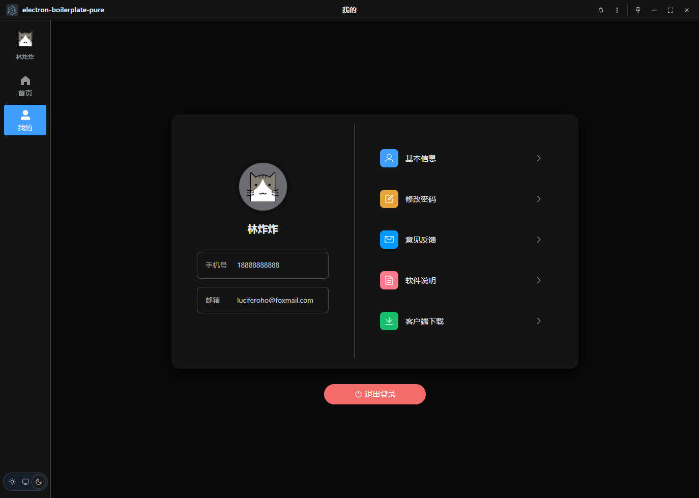
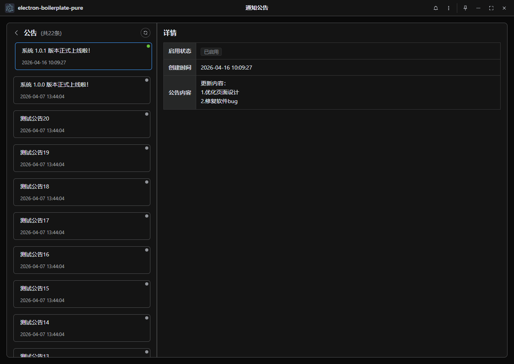
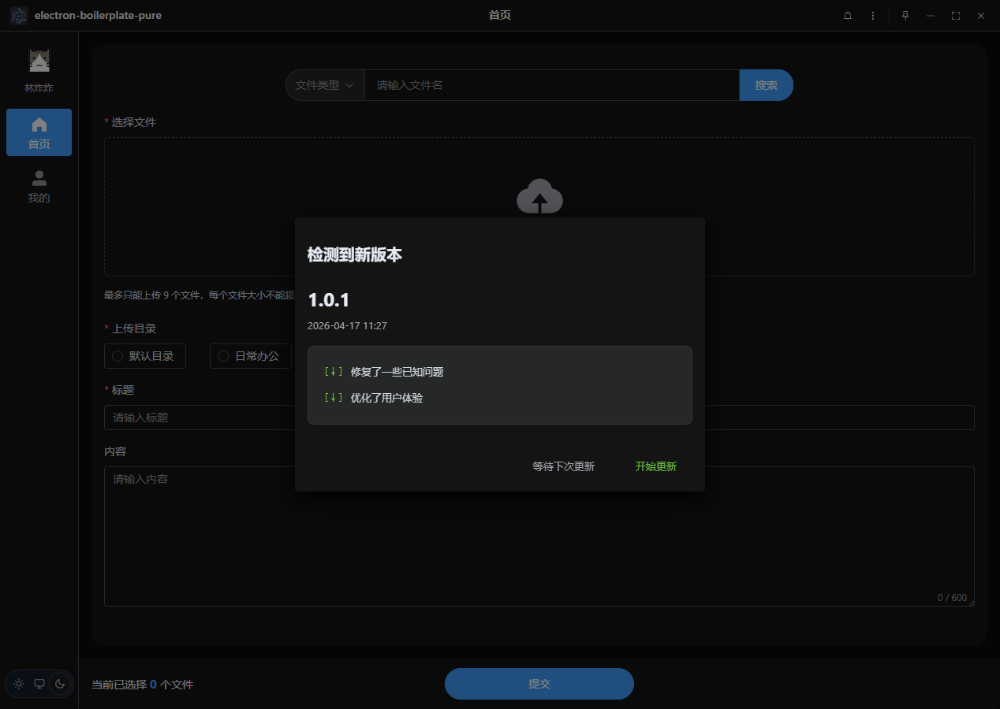
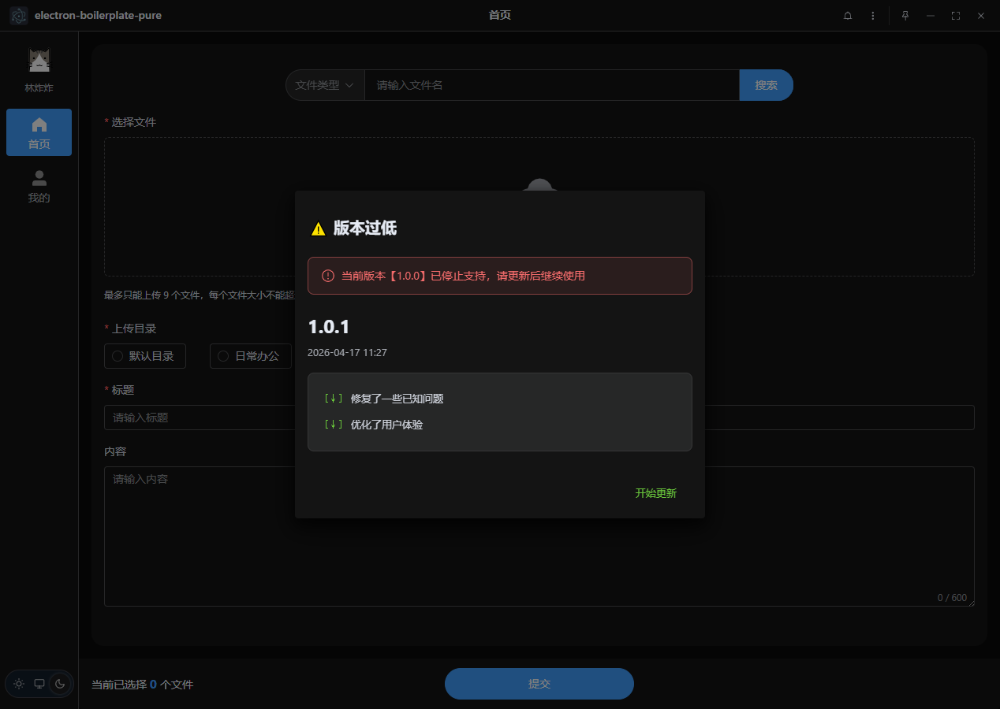

## 注意

- 层级关系
  - 窗口控制按钮层级为 `10000`
  - 更新弹窗层级为 `9999`
  - 其他所有弹窗层级尽量控制在上述层级以下，避免遮挡关键操作区域
- 全局dialog样式
  - `main.scss` 中限制了弹窗遮罩的top值, 避免遮挡标题栏; 同时避免弹窗全屏时, 弹窗右上角操作按钮被窗口操作按钮所遮挡, 导致弹窗无法退出全屏状态

    ```scss
    // 避免 Dialog 全屏时遮挡标题栏
    .el-modal-dialog,
    .el-overlay-dialog {
      top: 40px !important;
    }
    ```

  - 而像更新弹窗这类需要遮住标题栏的弹窗, 可在组件内覆盖默认样式

    ```vue
    <el-dialog
      modal-class="update-dialog-modal"
    >
    </el-dialog>
    ```

    ```scss
    // 遮住TitleBar
    .update-dialog-modal,
    .update-dialog-modal .el-overlay-dialog {
      top: 0 !important;
    }
    ```

- 全局message样式
  - `main.scss` 中设置了message的偏移, 以错开标题栏

  ```scss
  // 全局设置 Message 距离顶部的基础高度
  // 这里通过 CSS transform 来偏移整个消息容器
  .el-message.is-center {
    transform: translate(-50%, 36px) !important;
  }
  ```

## 常见问题

### 1. 中文乱码问题

**问题：** 问题描述：在 Windows 系统上，终端打印显示的中文字符出现乱码。

**解决：** 确保系统区域设置中启用了 UTF-8 支持（Windows 设置 → 区域 → 管理 → 更改系统区域设置 → 勾选"Beta: 使用 Unicode UTF-8 提供全球语言支持"）

### 2. 打包失败：文件被占用

**问题：** `EBUSY: resource busy or locked`

**解决：** 关闭开发工具，删除 `dist` 目录，重新打包

### 3. sqlite编译失败

**问题：** `better-sqlite3` 模块编译失败

**解决：**

```bash
yarn rebuild:sqlite
```

### 4. windows打包安装后，GPU进程崩溃导致应用无法启动

**问题：** 双击运行没反应，通过命令行运行时包含以下报错信息

```plaintext
GPU process exited
```

**解决：** 通过命令行启动应用，禁用GPU渲染和沙箱模式

```bash
electron-boilerplate-pure.exe --disable-gpu --disable-gpu-sandbox --in-process-gpu
```

### 5. windows打包安装后，空设备被禁用导致应用无法启动

[Electron issue](https://github.com/electron/electron/issues/44881)

**问题：** 双击运行没反应，通过命令行运行时报错信息如下

```plaintext
----- Native stack trace -----

1: 00007FF6C3D7CA62 llhttp_get_upgrade+46674
2: 00007FF6C3E0A2FD node::InitializeOncePerProcess+1757
3: 00007FF6C3E09C45 node::InitializeOncePerProcess+37
4: 00007FF6C3C9022A node::loader::ModuleWrap::IsLinked+3498
5: 00007FF6C3BD0404 uv_timer_get_repeat+85716
6: 00007FF6C4E971CD v8::internal::compiler::CompilationDependencies::DependOnInitialMapInstanceSizePrediction+2306893
7: 00007FF6C4E9AFE7 v8::internal::compiler::CompilationDependencies::DependOnInitialMapInstanceSizePrediction+2322791
8: 00007FF6C4E967CA v8::internal::compiler::CompilationDependencies::DependOnInitialMapInstanceSizePrediction+2304330
9: 00007FF6C412A63B std::__Cr::vector<v8::CpuProfileDeoptFrame,std::__Cr::allocator<v8::CpuProfileDeoptFrame> >::vector<v8::CpuProfileDeoptFrame,std::__Cr::allocator<v8::CpuProfileDeoptFrame> >+278363
10: 00007FF6C412B792 std::__Cr::vector<v8::CpuProfileDeoptFrame,std::__Cr::allocator<v8::CpuProfileDeoptFrame> >::vector<v8::CpuProfileDeoptFrame,std::__Cr::allocator<v8::CpuProfileDeoptFrame> >+282802
11: 00007FF6C412B5AA std::__Cr::vector<v8::CpuProfileDeoptFrame,std::__Cr::allocator<v8::CpuProfileDeoptFrame> >::vector<v8::CpuProfileDeoptFrame,std::__Cr::allocator<v8::CpuProfileDeoptFrame> >+282314
12: 00007FF6C4129E1F std::__Cr::vector<v8::CpuProfileDeoptFrame,std::__Cr::allocator<v8::CpuProfileDeoptFrame> >::vector<v8::CpuProfileDeoptFrame,std::__Cr::allocator<v8::CpuProfileDeoptFrame> >+276287
13: 00007FF6C4129FCD std::__Cr::vector<v8::CpuProfileDeoptFrame,std::__Cr::allocator<v8::CpuProfileDeoptFrame> >::vector<v8::CpuProfileDeoptFrame,std::__Cr::allocator<v8::CpuProfileDeoptFrame> >+276717
14: 00007FF6C3A9B618 node::FreePlatform+23304
15: 00007FF6C8930F02 Cr_z_crc32_z+6658978
16: 00007FFCA8307374 BaseThreadInitThunk+20
17: 00007FFCAA11CC91 RtlUserThreadStart+33

```

**解决：**

- 命令行中输入 `echo hello > nul`，此时应该会提示 【系统找不到指定的文件】
- 打开目录 `C:\Windows\System32\drivers`，查看当前目录下是否存在 `null.sys` 文件，如果不存在，可从相同版本的其他电脑中复制一个过来，也可以手动创建这个驱动服务
  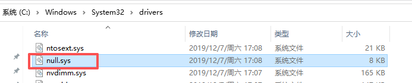
  - 重新创建 `null` 服务

  ```bash
  sc create null binPath= C:\Windows\System32\drivers\null.sys type= kernel start= auto error= normal
  ```

  - 启动该服务，如果看到状态变为 RUNNING，说明服务已经成功加载

  ```bash
  sc start null
  ```

- 检查并修复注册表映射
  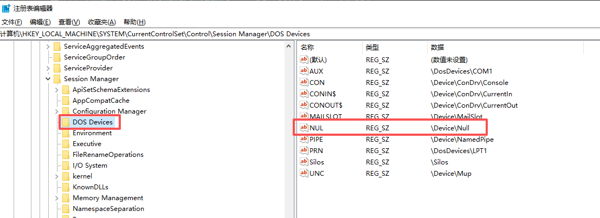
  - 按 Win + R，输入 regedit 回车。
  - 定位到：`HKEY_LOCAL_MACHINE\SYSTEM\CurrentControlSet\Control\Session Manager\DOS Devices`
  - 检查是否存在名为 `NUL` 的值，且数据为 `\Device\Null`
  - 如果不存在，右键 -> 新建 -> 字符串值，命名为 `NUL`，数值数据为 `\Device\Null`，确定后关闭注册表编辑器
- 检查并修复服务启动类型
  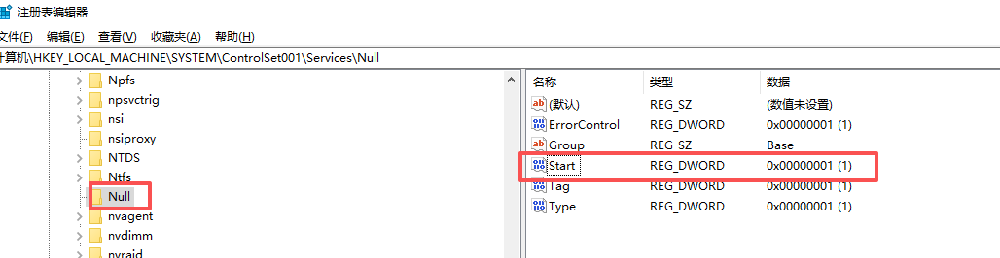
  - 定位到：`HKEY_LOCAL_MACHINE\SYSTEM\ControlSet001\Services\Null`
    - 检查是否存在名为 `Start` 的值，且数据为 `1`
    - 如果不存在，右键 -> 新建 -> 32 位 DWORD 值，命名为 `Start`，数值数据为 `1`，确定后关闭注册表编辑器
  - 如果 `Services` 中不存在 `Null`，可将以下内容保存为reg文件，双击后自动添加注册表

  ```reg
  Windows Registry Editor Version 5.00

  [HKEY_LOCAL_MACHINE\SYSTEM\ControlSet001\Services\Null]
  "ErrorControl"=dword:00000001
  "Group"="Base"
  "Start"=dword:00000001
  "Tag"=dword:00000001
  "Type"=dword:00000001
  ```

- 如果修改了注册表，需要**重启电脑**才能生效；如果没有，可跳过这一步
- 检查修复情况：命令行中输入 `echo hello > nul`，如果光标直接跳到下一行，说明修复成功
- 再次尝试运行应用，应该就可以正常启动了

## License

2026 © Lucifer, Released under the MIT License.

[个人网站](https://superlucifer.cn) · [GitHub](https://github.com/luciferoho)
